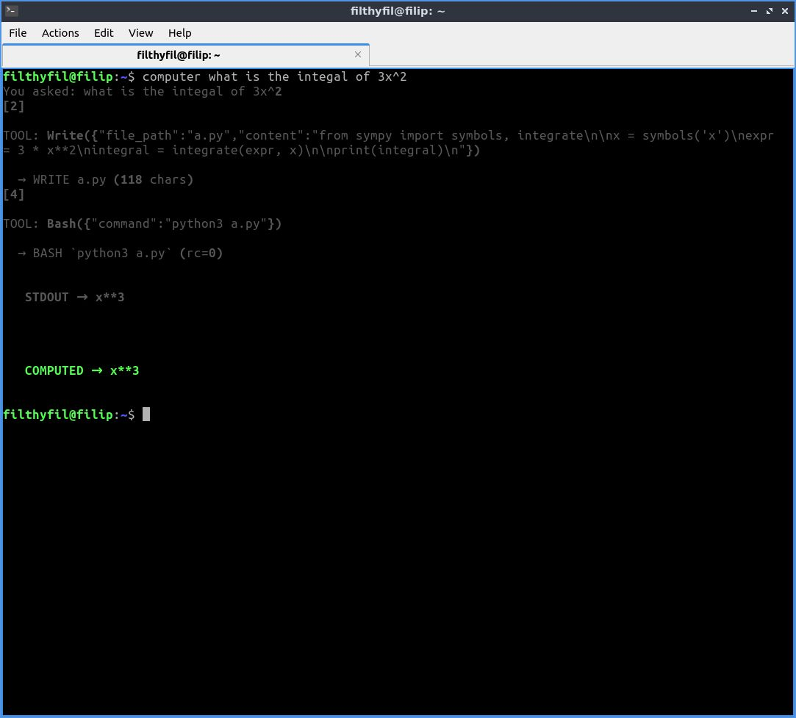

# Computer CLI
## What's this?
**Computer** is a personal command-line assistant that lets you run Python code, evaluate math expressions, and interact with tools via natural language prompts.

Think of it like talking to a calculator directly from your terminal, where unstructured inputs are allowed:

```bash
computer what is 1+1
computer whats the integral of x^3
computer does 1=3?
```

Since the model should be using sympy to evaluate queries, you are guarenteed a correct answer given the problem statement is interpreted and set up correctly in python code. Whatever the model writes is visible to the user. You can see an image of what the project looks like below:



## Features
 - (Usually) evaluates math expressions using sympy
 - Run arbitrary Python one-liners through your CLI
 - Practically limited to the sandbox directory to write scripts. Certain libraries are off limits.
 - Provides safety checks for shell commands and python scripts
 - Supports tools (Read, Write, Bash, Confusion)

## What is the motivation?
This was a project inspired by the CodeCrafters challenge completed in order to "make your own claude code." I tend to use AI to do my computations nowadays, since I am too lazy to properly format it into some CAS or calculator. Fortunately, there are new solutions in the world for unstructured inputs.

## How does it work, briefly?
This project takes an input from the user from which it will construct a python program, execute it, and print the output from the user. Why not have the model tell you the answer directly? Because I wanted to curb the event that the model makes a trivial mathematical mistake or take a wild approach for something that can be done algorithmically. I wanted to avoid the case in which the AI can generate the correct answer, but because of conflict from memorized answers from the training data, go with another. This approach also doesn't let the model reason about the final answer, in a way that may be counterproductive. The model has 4 tools. It can Read files (to solve stderr), it can Write files, it can execute Bash commands, and it has a flag to demonstrate to the user that it is confused. The reason for the latter is to give the model a clear way out if it's not able to make sense of the user's input, or if the model encounters some error that it doesn't know how to resolve.

There are some guardrails for the Bash and Write tool that are in the linter `linter.py`. They simply just find possibly dangerous keywords like `os`, `rm`, `unmount`, and terminates the program if they are there. This could probably be better

The mechanics of the projects are fairly straightforward as seen in the main project file `main.py`. Most of the hardwork was already completed (in the API), and luckily all I've had to do was obey the API in defining tools and their usage. 

This project uses Groq or ollama as the service for inference. Make sure you have your `GROQ_API_KEY` or `OLLAMA_API_KEY` set in your environment variables.

## How do I set this up?
#### Only do this if you want to set this up as a CLI tool, as it's not necessary.
Make sure you have your `GROQ_API_KEY` or `OLLAMA_API_KEY` set in your environment variables.

Make sure you have `uv` installed and navigate to the project's root. You know you are there if you run 'ls' and you see 'pyproject.toml'. Here, you can run 

```bash
uv tool install --editable .
```

## How do I use this? 
> As these things are probabilistic, conclusions vary. That is, sometimes (mostly) it works; othertimes, it doesn't.


Make sure you have `uv` installed and run the following command: 

```bash
uv run /<PathTo>/app/main.py <your_prompt_here>
```

If you have installed it as a CLI tool, you can just run:

```bash
computer <your_prompt_here>
```

### Examples
Examples are fun

```bash
filthyfil@filip:~$ computer does 1=1
You asked: does 1=1
[2] 

TOOL: Bash({"command":"python3 -c \"print(1 == 1)\""})


   COMPUTED → True


filthyfil@filip:~$ computer whats the integral of x^3
You asked: whats the integral of x^3
[2] 

TOOL: Bash({"command":"python3 -c \"from sympy import symbols, integrate; x = symbols('x'); 
print(integrate(x**3, x))\""})


   COMPUTED → x**4/4

```
